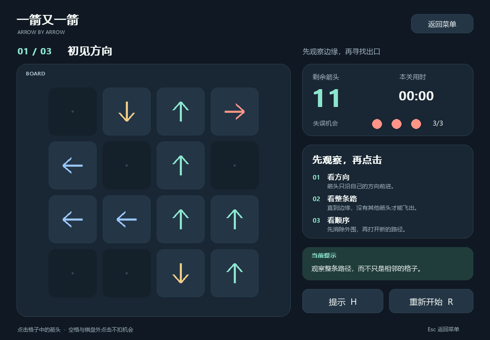
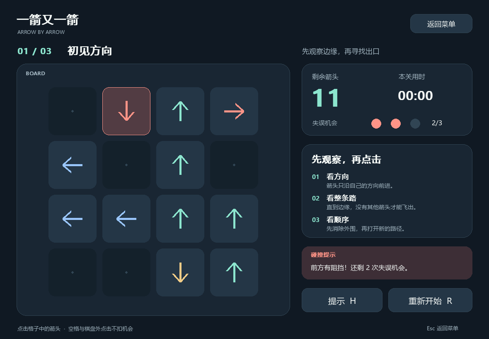
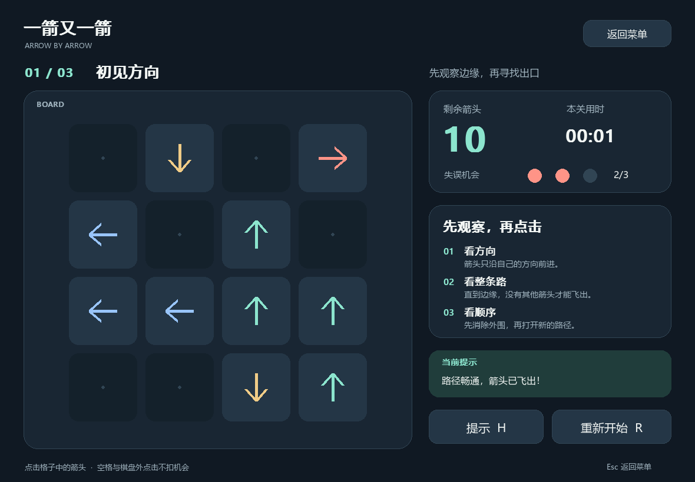
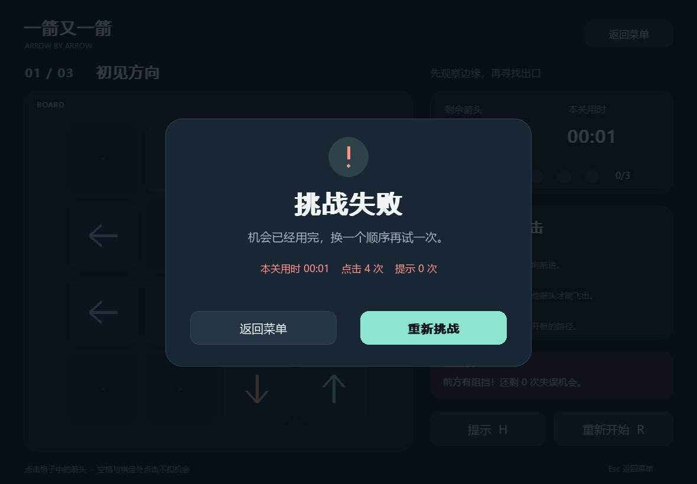
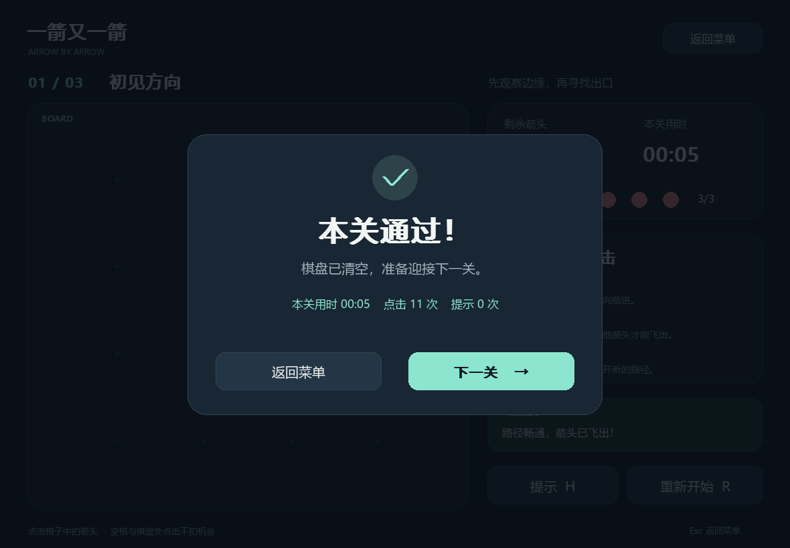
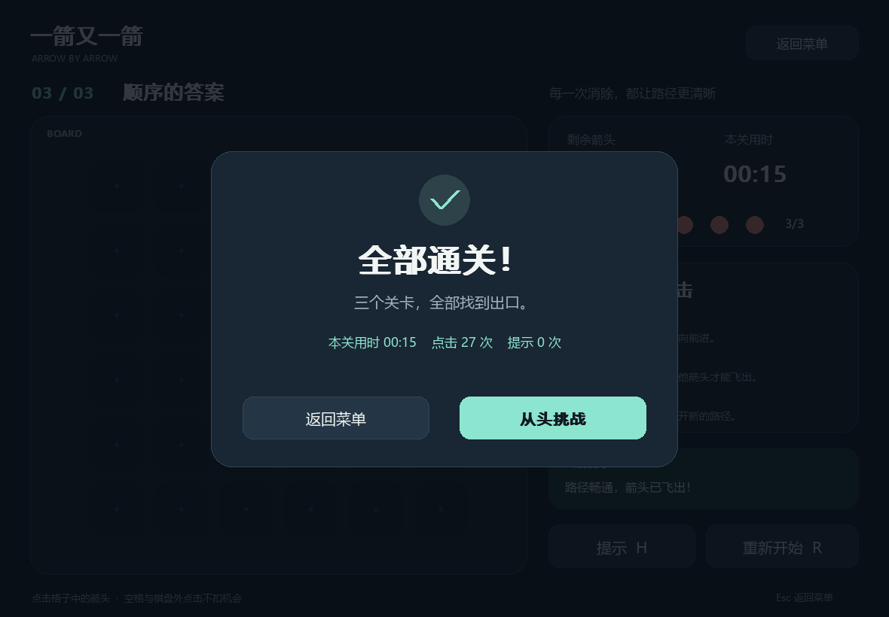
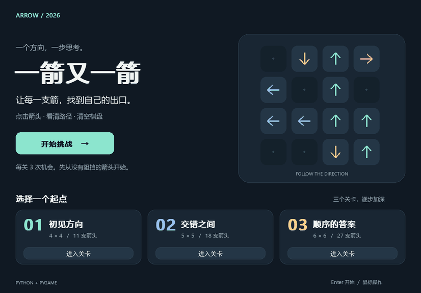

# 一箭又一箭：使用 Python 与 Codex 完成箭头解谜游戏

| 项目 | 内容 |
|---|---|
| 这个作业属于哪个课程 | [2026-01 软件工程与软件工程实践](https://edu.cnblogs.com/campus/fzu/2026-01SoftwareEngineeringandSoftwareEngineeringPractice) |
| 这个作业要求在哪里 | [个人作业（二）：一箭又一箭](https://edu.cnblogs.com/campus/fzu/2026-01SoftwareEngineeringandSoftwareEngineeringPractice/homework/16718) |
| 这个作业的目标 | 使用 Python 和 AIGC 完成“一箭又一箭”小游戏，验证规则、记录开发过程并使用 Git 管理项目 |
| 学号 | 102401314 |
| GitHub 仓库 | [k0n0y/arrow-game](https://github.com/k0n0y/arrow-game) |

> 本稿记录 Codex 辅助开发、本地自动测试和本人提供的三关通关截图。本人三关试玩结果已补充；发布博客前仍需填写真实 PSP 时间并补充个人心得。

## 一、项目展示

本项目采用 Python + pygame-ce，实现基础单格箭头玩法。所有界面元素、箭头和关卡均由本项目代码生成，不使用原商业游戏素材。

### 1. 开始界面

开始页面展示规则入口、开始按钮及三关选择。可从第一关开始，也可直接选择关卡练习。


### 2. 游戏与碰撞反馈

游戏界面显示当前关卡、棋盘、剩余箭头、剩余失误次数、本关用时、提示和重开按钮。



下面的向下箭头前方有其他箭头，即使相邻格为空也不能飞出。误点后原箭头保留、格子变红并晃动，机会由 3 次变为 2 次。



路径畅通时播放飞出动画，箭头数量减一。



### 3. 失败、通关与完成







### 4. 演示 GIF



以上为实际 pygame 程序通过脚本投递鼠标事件后的渲染结果。GIF 对部分中间操作进行了省略并调整播放节奏，界面计时来自模拟步长，不作为个人试玩速度或开发耗时。

### 5. 本人实际试玩

以下是本人提供的游戏窗口截图，与上方自动回放截图分别保存。材料收到日期为 2026-09-19。

| 关卡 | 界面显示用时 | 点击次数 | 提示次数 | 剩余机会 | 界面结果 |
|---|---:|---:|---:|---|---|
| 1 · 初见方向 | 8 秒 | 12 | 0 | 2/3 | 本关通过 |
| 2 · 交错之间 | 12 秒 | 18 | 0 | 3/3 | 本关通过 |
| 3 · 顺序的答案 | 18 秒 | 27 | 0 | 3/3 | 全部通关 |

三关均有通关结果截图，提示次数均为 0。第一关显示剩余 2 次机会，第二、三关各剩余 3 次机会。


三关界面计时合计 38 秒。这不包含启动、阅读规则、重复尝试、截图整理等总用时，不能直接作为 PSP 的测试与修改耗时。

本人随后确认：失误机会耗尽后的重新挑战，以及游戏中途重新开始恢复棋盘和 3 次机会，两项测试均正常。本次完整试玩（包括熟悉规则、重试与截图）实际投入约 2 分钟，按本人估算记录。

## 二、项目简介

### 游戏规则

1. 棋盘由网格组成，每个格子为空或包含上下左右之一的箭头。
2. 点击箭头后沿自身方向检查，直到棋盘边缘。
3. 没有其他箭头阻挡时，当前箭头飞出并消除；有阻挡时保留并扣一次机会。
4. 每关初始有 3 次机会，耗尽后失败；清空棋盘后通关。
5. 重开恢复当前关卡的初始棋盘和全部机会。

### 关卡和界面设计

| 关卡 | 名称 | 大小 | 箭头数量 | 初始可消除箭头 |
|---|---|---|---:|---:|
| 1 | 初见方向 | 4×4 | 11 | 5 |
| 2 | 交错之间 | 5×5 | 18 | 7 |
| 3 | 顺序的答案 | 6×6 | 27 | 13 |

每关均包含四种方向。关卡规模逐步增大；难度感受还需要结合本人试玩评价。界面采用深色背景和不同颜色箭头，右侧集中展示规则、进度和反馈。

### 主要功能和扩展

基础功能覆盖开始、点击消除、碰撞、三次失误、通关、失败、下一关和重开。扩展包括选关、提示高亮、本关计时和 Windows 可执行版。
提示只通过确定性规则查找当前可消除箭头，没有在线调用大模型。图形与逻辑解耦，方便独立测试。

## 三、实现思路

### 数据结构与模块划分

`levels.py` 使用字符串元组保存不可变关卡，U/D/L/R 分别表示四方向，`.` 表示空格。开始游戏时将其复制为二维列表，因此重开不会受到已消除箭头的影响。

`game_logic.py` 实现路径检测、可解性检查和游戏状态；`ArrowGame.py` 实现图形、按钮、鼠标命中、动画与计时。测试无需启动实际桌面窗口也能检查核心规则。

### 核心路径检测

方向通过行列增量统一处理：U=(-1,0)、D=(1,0)、L=(0,-1)、R=(0,1)。从箭头前方第一个格子开始扫描，边界检查在访问数组之前执行。

以下代码摘自本项目实际实现：

```python
def first_blocker(board: Board, row: int, col: int) -> tuple[int, int] | None:
    """Return the nearest obstacle on a valid arrow's entire forward ray."""
    if not has_arrow(board, row, col):
        return None
    dr, dc = DIRECTIONS[board[row][col]]
    r, c = row + dr, col + dc
    while 0 <= r < len(board) and 0 <= c < len(board[0]):
        if board[r][c] != ".":
            return r, c
        r, c = r + dr, c + dc
    return None
```

`can_exit()` 先用 `has_arrow()` 排除空格和越界，再检查 `first_blocker()` 是否返回 None。例如 `R..U` 会找到最右侧的 U，因此不能飞出；`R...` 可直接离开。
单次扫描最坏时间为 O(max(R,C))，额外空间为 O(1)。

### 可解关卡

关卡由逆向插入法构造：每次只加入一支当前能直接飞出的箭头。按相反插入顺序删除，即得到一个合法解序列。最终冻结为三个关卡模板，启动时再次校验。

还使用 `solve()` 独立寻找消除顺序。因为删除箭头只会减少障碍，任何当前可执行的消除操作都不会让其他箭头更难离开，所以可以反复删除可消除箭头而不需要回溯。

### 状态与动画

状态包括 MENU、PLAYING、WON、LOST、COMPLETE。只有 PLAYING 允许操作棋盘；非最后关清空进入 WON，最后关清空进入 COMPLETE；生命为 0 进入 LOST。

规则立即决定成功或失败，再由界面根据结果播放约 0.48 秒动画。飞出时位置随时间移动；碰撞时沿箭头方向小幅往返并显示红色提示。动画期间屏蔽棋盘重复点击，重开会同时清除动画。

## 四、AIGC 使用过程

本次使用 **Codex**。以下四条来自同一任务的不同实际开发阶段，不是事后虚构的独立对话。用户提供需求并纠正来源，初始代码和测试由 AI 辅助实现。

| 子任务 | AIGC 技术 | AI 提供的内容 | 实际效果 | 人工参与/修改 |
|---|---|---|---|---|
| 需求澄清 | Codex | 整理 11 项游戏功能、T01—T06 和材料要求，设计模块结构 | 明确最初博客为同学示例，正式截图成为验收依据 | 用户提供正确链接与 6 张截图 |
| 路径与关卡 | Codex | 四方向整条射线扫描、状态机、逆向构造和独立测试 | 首轮 32 项通过；发现第一候选关缺少右箭头后重新筛选 | 暂无学生手工代码修改记录，修正由 Codex 执行 |
| 图形与交互 | Codex | 中文界面、飞出与碰撞动画、事件回放测试 | 40 项阶段测试通过，三关鼠标事件流程完成 | 后续本人提供了三关通关截图，均未使用提示 |
| 画面检查和修正 | Codex | 读取程序截图检查布局与图标 | 发现勾号变方框，改为线段绘制；最终 44 项测试通过 | 不把 AI 修正记作学生手工修正 |

原始开发记录见 `aigc_log.md`。本次明确遇到的问题包括正式页登录拦截、命令行嵌套引号错误、第一候选关方向不全、结果图标缺字；没有沿用他人博客中的调试经历。

## 五、测试结果

环境：Windows 11 x64、Python 3.13.15、pygame-ce 2.5.8、pytest 9.1.1。

实际运行：

```powershell
.\.venv\Scripts\python.exe tools/verify.py
```

最终结果为 **44 passed**，无失败、错误或跳过。

| 编号 | 操作/测试场景 | 预期结果 | 实际结果 | 是否通过 |
|---|---|---|---|---|
| T01 | 点击前方无遮挡箭头 | 飞出并消失，剩余箭头数减 1 | 四方向规则正确；事件测试验证删除、飞出动画和输入锁 | 通过 |
| T02 | 点击有阻挡的箭头，包括远距离障碍 | 箭头保留，失误机会减 1，显示碰撞反馈 | 四方向远处障碍均检测；棋盘不变，生命 3→2，红色/晃动反馈 | 通过 |
| T03 | 点击边界朝外箭头 | 消失且不越界 | 上下左右边界的规则和鼠标事件均通过，机会保持 3 | 通过 |
| T04 | 消除全部箭头，点击下一关 | 显示通关并进入下一关 | 三关按顺序通过，第三关显示全部通关 | 通过 |
| T05 | 连续三次误点 | 失败并可重试 | 生命变为 0，停止棋盘操作，重试恢复 | 通过 |
| T06 | 游戏中重开当前关 | 布局和失误数恢复 | 当前关索引保留、原始布局恢复、生命 3、计时/动画/提示清空 | 通过 |

补充检查包括 625 种 2×2 棋盘的独立算法核对、45 个不同种子生成关卡的完整解序列验证，以及 64 次 pygame 事件回放。源码和打包 EXE 都在本机 Windows SDL 图形驱动中启动成功。

自动验证证据：`evidence/test_output.txt`、`test_summary.json`、`ui_replay.json`、`source_smoke.json`、`exe_smoke.json`。本人通关证据：`evidence/manual_playtest.json` 与 `docs/images/manual/` 中的三张原图。本人另外确认 T05 失败重试、T06 中途重开测试均正常；该两项手动结果记录为文字确认。其他机器兼容性尚未实测。

## 六、PSP 时间记录

以下预计值在读取正式截图后、核心编码前制定，单位为小时。实际耗时应由本人按真实参与情况填写；AI 执行时间不等于学生本人开发时间。

| 任务 | 预计耗时（小时） | 实际耗时（小时） | 差异（实际 − 预计） |
|---|---:|---:|---:|
| 需求分析与游戏设计 | 0.50 | 待本人填写 | 待计算 |
| Python 与图形库学习 | 0.75 | 待本人填写 | 待计算 |
| 游戏界面实现 | 1.00 | 待本人填写 | 待计算 |
| 路径与碰撞逻辑实现 | 0.75 | 待本人填写 | 待计算 |
| 关卡设计 | 0.50 | 待本人填写 | 待计算 |
| AIGC 辅助开发记录 | 0.25 | 待本人填写 | 待计算 |
| 测试与修改 | 0.75 | 约 0.0333（本次本人试玩约 2 分钟） | 约 -0.7167（按已记录时间） |
| README 与博客撰写 | 0.75 | 待本人填写 | 待计算 |
| 合计 | **5.25** | **已确认约 0.0333，其余待填写** | **待其余阶段填写后计算** |

“AIGC 辅助开发记录”仅计入查看/整理 AI 使用过程的独立时间，避免与编码和测试重复统计。差异分析需在填入实际值后完成，不能直接套用他人的时间。

其中“测试与修改”目前记录的是本人本次试玩约 2 分钟，即约 0.0333 小时；按此记录与 0.75 小时建议预算计算，差异约为 -0.7167 小时。当前只统计本人已确认的试玩投入，不包含 AI 自动化测试执行，也不代表整个项目总共只用 2 分钟；其他阶段待本人补充。

## 七、心得体会

从本次实现可以得到三个具体认识：第一，路径判断中的“检查到边缘”是规则正确性的关键，不能以相邻格为空代替；第二，逻辑与界面分离后，自动化测试可以直接检查规则和状态，事件回放再补充交互验证；第三，逻辑通过不等于显示正确，结果图标缺字就是通过实际画面才发现的问题。

AIGC 在需求拆分、代码实现、构造测试和整理文档方面提供了帮助；生成结果仍需要证据检验。本项目记录了真实发现和修改，也保留了多次 Git 提交，便于查看各阶段的变化。

本人提供的截图表明三个关卡均已通过，提示次数均为 0；第一关显示剩余 2 次机会，另外两关为 3 次。

本人另确认失败重试和中途重开均正常，本次试玩共约 2 分钟。

**本人补充区（发布前填写）**：最容易误判的地方、亲自理解或修改了哪段代码，以及最终学到什么。主观体验待本人补充。

## 八、运行与提交说明

可执行版双击 `ArrowGame.exe`。源码版：

```powershell
py -3.13 -m venv .venv
.\.venv\Scripts\python.exe -m pip install -r requirements.txt
.\.venv\Scripts\python.exe ArrowGame.py
```

GitHub 已发布至 [k0n0y/arrow-game](https://github.com/k0n0y/arrow-game)，并保留原有五次开发提交。发布博客时仍需要将图片上传至博客园并替换本地相对路径；博客园发布与班级提交尚未完成。

### 资料与素材说明

- 作业规则来自本文首表中的正式作业页及用户提供的完整截图。
- 初始背景参考为 [PIG— 的作业博客](https://www.cnblogs.com/PIG1/p/23001643)，未复制其源码、截图或时间记录。
- 本项目无外部美术或音效素材；所有箭头、界面图形和关卡由代码生成。系统中文字体只在运行时调用，没有将商业字体文件复制到仓库。
