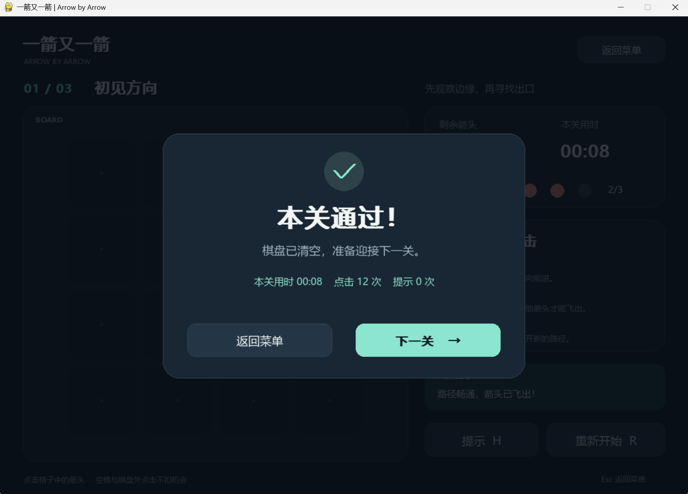
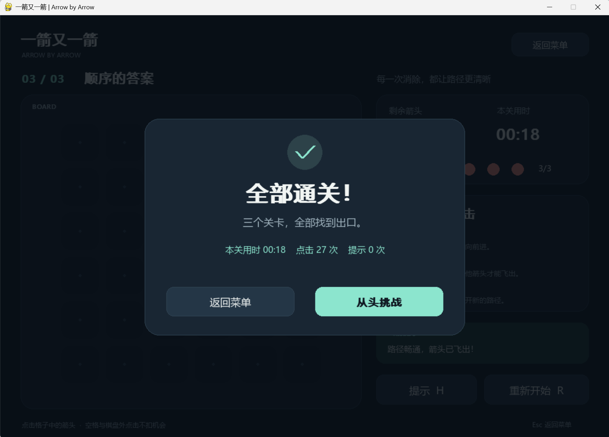

# 测试报告

自动化验证日期：2026-09-16。环境：Windows-11-10.0.26200-SP0，Python 3.13.15，pygame-ce 2.5.8。本人试玩材料收到日期见后文。

`python tools/verify.py` 实际结果：**44 passed**，0 failures / 0 errors / 0 skipped。
JUnit 记录的测试套件耗时为 1.147 秒；它不等于个人开发耗时。

| 编号 | 操作/测试场景 | 预期结果 | 实际结果 | 是否通过 |
|---|---|---|---|---|
| T01 | 点击前方无遮挡箭头 | 飞出并消失，剩余箭头数减 1 | 四方向规则正确；事件测试验证删除、飞出动画和输入锁 | 通过 |
| T02 | 点击有阻挡的箭头，包括远距离障碍 | 箭头保留，失误机会减 1，显示碰撞反馈 | 四方向远处障碍均检测；棋盘不变，生命 3→2，红色/晃动反馈 | 通过 |
| T03 | 点击边界朝外箭头 | 消失且不越界 | 上下左右边界的规则和鼠标事件均通过，机会保持 3 | 通过 |
| T04 | 消除全部箭头，点击下一关 | 显示通关并进入下一关 | 三关按顺序通过，第三关显示全部通关 | 通过 |
| T05 | 连续三次误点 | 失败并可重试 | 生命变为 0，停止棋盘操作，重试恢复 | 通过 |
| T06 | 游戏中重开当前关 | 布局和失误数恢复 | 当前关索引保留、原始布局恢复、生命 3、计时/动画/提示清空 | 通过 |

## 补充验证

- 独立搜索算法核对全部 625 种 2×2 棋盘的路径判断和可解性。
- 4×4、5×5、6×6 各 15 个种子，共 45 个生成布局，逐步移除验证全部可解。
- 三个正式关卡均包含 U/D/L/R，箭头数量分别为 11、18、27。
- 菜单、空格、越界、格子间隙、动画期间的重复点击和关闭事件。
- `tools/capture_evidence.py` 回放了 64 次鼠标事件，保存 10 张界面截图、39 帧 GIF 和状态日志。
- 源码实际启动：SDL driver=windows，frozen=False，状态 playing。
- EXE 实际启动：SDL driver=windows，frozen=True，状态 playing，退出码 0。

## 发现的问题和修正

画面检查发现默认中文字体不能正确显示勾号，结果页出现方框；已改为几何线段绘制，并重新生成截图、运行测试与打包。该问题说明逻辑测试通过仍需要检查实际画面。

## 证据和边界

- 原始测试输出：`evidence/test_output.txt`；机器可读结果：`tests.xml`、`test_summary.json`。
- UI 动作与解序列：`evidence/ui_replay.json`。坐标和解序列采用 0 起点。
- 源码和可执行文件启动：`evidence/source_smoke.json`、`evidence/exe_smoke.json`。
- `docs/images/` 根目录中的截图由同一 pygame 程序在 SDL dummy 显示驱动下经过真实事件回放渲染；本人提供的截图另存于 `docs/images/manual/`。
- Windows 驱动测试证明本机能启动和绘制。完整流程由自动事件测试验证，尚不证明其他电脑兼容性。

## 本人三关试玩记录

用户于 2026-09-19 提供了三张实际游戏窗口截图，分别显示第一关通过、第二关通过和第三关全部通关。此日期为收到材料的日期，截图本身未记录操作日期。原图保持不变，并在 `evidence/manual_playtest.json` 中保存 SHA-256 校验值。

| 关卡 | 界面显示用时 | 点击次数 | 提示次数 | 剩余机会 | 界面结果 |
|---|---:|---:|---:|---|---|
| 1 · 初见方向 | 8 秒 | 12 | 0 | 2/3 | 本关通过 |
| 2 · 交错之间 | 12 秒 | 18 | 0 | 3/3 | 本关通过 |
| 3 · 顺序的答案 | 18 秒 | 27 | 0 | 3/3 | 全部通关 |

三关界面计时合计 38 秒。这不包含启动、阅读规则、重复尝试、截图整理等总用时，不能直接作为 PSP 的测试与修改耗时。

本人随后确认：失误机会耗尽后的重新挑战，以及游戏中途重新开始恢复棋盘和 3 次机会，两项测试均正常。本次完整试玩（包括熟悉规则、重试与截图）实际投入约 2 分钟，按本人估算记录。

| 手动检查 | 预期结果 | 本人实际反馈 | 证据形式 |
|---|---|---|---|
| T05：失误耗尽后重新挑战 | 失败后可重新挑战 | 已测试，正常 | 本人文字确认 |
| T06：游戏中途重开 | 棋盘恢复初始布局、机会恢复为 3 | 已测试，正常 | 本人文字确认 |

截图直接支持三个关卡的通关结果、点击次数、提示次数与剩余机会；T05、T06 的手动结果来自本人补充确认。静态结果截图不单独证明动画细节或完整点击过程。
